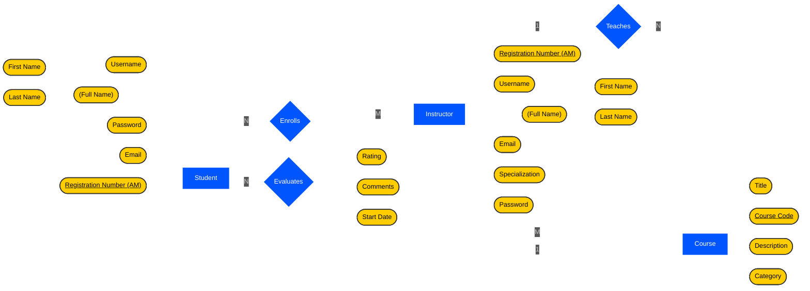
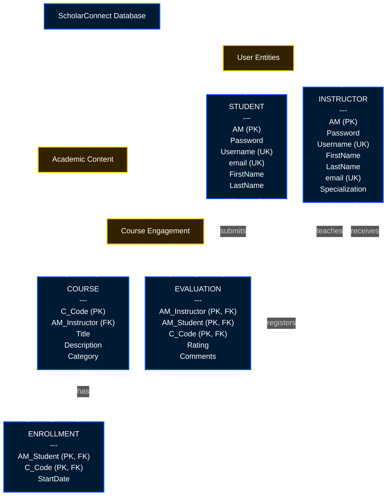
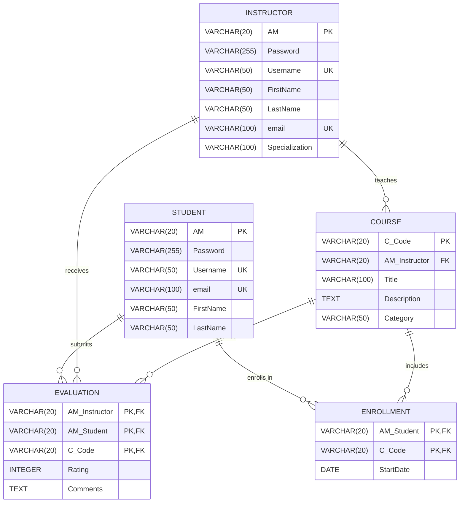

## Database Diagrams

### Conceptual ER Diagram (Chen Notation)

### Schema Hierarchy View

### Relational Schema (Crow's Foot Notation)

#### Legend / Abbreviations
* **PK** - Primary Key
* **FK** - Foreign Key
* **UK** - Unique Key

---

#### The executable schema code is in the file: [`schema.sql`](./schema.sql).
