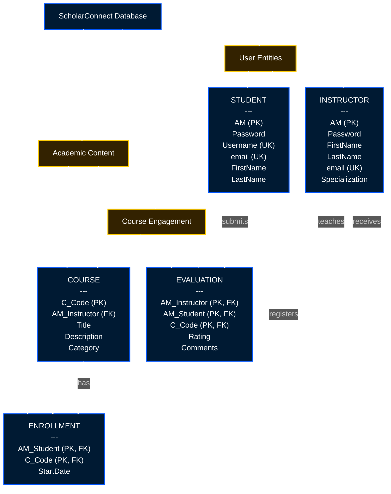

## SQLite Schema
### ER Diagram

```mermaid
%%{init: {
  'theme': 'dark',
  'themeVariables': {
    'background': '#000000',
    'lineColor': '#ffffff',
    'primaryColor': '#0055ff',
    'primaryBorderColor': '#ffffff',
    'primaryTextColor': '#ffffff',
    'secondaryColor': '#ffcc00',
    'tertiaryColor': '#e6b800',
    'mainBkg': '#001a33',
    'nodeBorder': '#0055ff'
  },
  'flowchart': {
    'curve': 'step',
    'defaultRenderer': 'elk'
  }
}}%%
flowchart TD
 
    db_root["ScholarConnect Database"]
    
    %% Primary Binary Split
    db_root --> users_branch["User Entities"]
    db_root --> academic_branch["Academic Content"]
    
    %% User Entities Branch
    users_branch --> student_node["STUDENT<br/>---<br/>AM (PK)<br/> Password<br/>Username (UK)<br/>email (UK)<br/>FirstName<br/>LastName"]
    users_branch --> instructor_node["INSTRUCTOR<br/>---<br/>AM (PK)<br/> Password<br/>FirstName<br/>LastName<br/>email (UK)<br/>Specialization"]
    
    %% Academic Content Branch
    academic_branch --> course_node["COURSE<br/>---<br/>C_Code (PK)<br/>AM_Instructor (FK)<br/> Title<br/> Description<br/> Category"]
    academic_branch --> engagement_branch["Course Engagement"]
    
    %% Engagement Branch 
    engagement_branch --> enrollment_node["ENROLLMENT<br/>---<br/>AM_Student (PK, FK)<br/>C_Code (PK, FK)<br/>StartDate"]
    engagement_branch --> evaluation_node["EVALUATION<br/>---<br/>AM_Instructor (PK, FK)<br/>AM_Student (PK, FK)<br/>C_Code (PK, FK)<br/>Rating<br/>Comments"]

    %% Relational Connections | (Orthogonal Dotted Lines) `-.->`
    student_node -.->|registers| enrollment_node
    course_node -.->|has| enrollment_node
    student_node -.->|submits| evaluation_node
    instructor_node -.->|receives| evaluation_node
    instructor_node -.->|teaches| course_node

    %% Styling and Aesthetics
    classDef default fill:#001a33,stroke:#0055ff,stroke-width:2px,color:#ffffff;
    classDef branch fill:#332200,stroke:#ffcc00,stroke-width:2px,color:#ffffff;
    
    class users_branch,academic_branch,engagement_branch branch;
    class db_root fill:#000000,stroke:#ffffff,stroke-width:3px;
```

#### The executable schema code is in the file: [`schema.sql`](./schema.sql).
