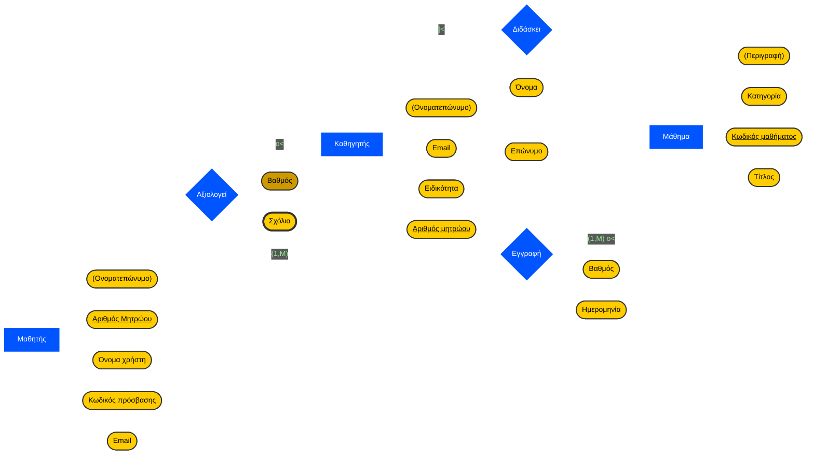

```mermaid
%%{init: {'theme': 'dark', 'themeVariables': { 'background': '#000000', 'lineColor': '#ffffff'}}}%%
flowchart LR
    %% Diagram name: askbd

    %% Entities
    S[Μαθητής]
    P[Καθηγητής]
    C[Μάθημα]

    %% Relationships
    Eval{Αξιολογεί}
    Enroll{Εγγραφή}
    Teach{Διδάσκει}

    %% Entity-Relationship Connections (using longer lines to untangle)
    S ---- Eval
    Eval ----|"<font color='lightgreen'>o&lt;</font>"| P

    S ----|"<font color='lightgreen'>(1,M)</font>"| Enroll
    Enroll ----|"<font color='lightgreen'>(1,M) o&lt;</font>"| C

    P ----|"<font color='lightgreen'>|&lt;</font>"| Teach
    Teach ---- C

    %% Attributes S
    S_Name(["(Ονοματεπώνυμο)"])
    S_AM(["<u>Αριθμός Μητρώου</u>"])
    S_User([Όνομα χρήστη])
    S_Pass([Κωδικός πρόσβασης])
    S_Email([Email])

    S --- S_Name
    S --- S_AM
    S --- S_User
    S --- S_Pass
    S --- S_Email

    %% Attributes Eval
    Eval_Grade([Βαθμός]):::shaded
    Eval_Comments([Σχόλια]):::multivalued

    Eval --- Eval_Grade
    Eval --- Eval_Comments

    %% Attributes P
    P_Name(["(Ονοματεπώνυμο)"])
    P_FName([Όνομα])
    P_LName([Επώνυμο])
    P_Email([Email])
    P_Spec([Ειδικότητα])
    P_AM(["<u>Αριθμός μητρώου</u>"])

    P --- P_Name
    P_Name --- P_FName
    P_Name --- P_LName
    P --- P_Email
    P --- P_Spec
    P --- P_AM

    %% Attributes Enroll
    Enroll_Grade([Βαθμός])
    Enroll_Date([Ημερομηνία])

    Enroll --- Enroll_Grade
    Enroll --- Enroll_Date

    %% Attributes C
    C_Desc(["(Περιγραφή)"])
    C_Cat([Κατηγορία])
    C_Code(["<u>Κωδικός μαθήματος</u>"])
    C_Title([Τίτλος])

    C --- C_Desc
    C --- C_Cat
    C --- C_Code
    C --- C_Title

    %% Apply Classes to Entities and Relationships (Roots)
    class S,P,C,Eval,Enroll,Teach rootNode;

    %% Apply Classes to Attributes (Branches)
    class S_Name,S_AM,S_User,S_Pass,S_Email,P_Name,P_FName,P_LName,P_Email,P_Spec,P_AM,Enroll_Grade,Enroll_Date,C_Desc,C_Cat,C_Code,C_Title branchNode;

    %% Styling Definitions
    classDef rootNode fill:#0055ff,stroke:#fff,stroke-width:2px,color:#fff;
    classDef branchNode fill:#ffcc00,stroke:#333,stroke-width:2px,color:#000;
    classDef shaded fill:#cc9900,stroke:#333,stroke-width:2px,color:#000;
    classDef multivalued fill:#ffcc00,stroke:#333,stroke-width:4px,color:#000;
```