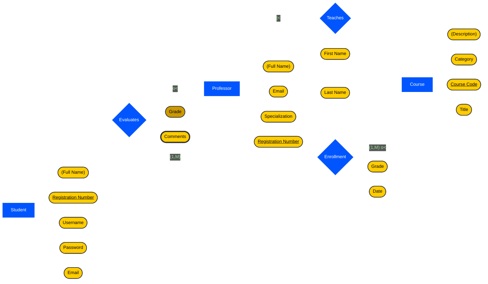

## SQL Schema

```sql
CREATE TABLE Students (
    /**
     * Stores information about students enrolled in the system.
     * 
     * Args:
     *     registration_number (VARCHAR): The unique student identifier.
     *     full_name (VARCHAR): The full name of the student.
     *     username (VARCHAR): Unique name used for authentication.
     *     password (VARCHAR): Securely stored credential for login.
     *     email (VARCHAR): Student's primary contact address.
     */
    registration_number VARCHAR(20) PRIMARY KEY,
    full_name VARCHAR(100) NOT NULL,
    username VARCHAR(50) UNIQUE NOT NULL,
    password VARCHAR(255) NOT NULL,
    email VARCHAR(100) UNIQUE NOT NULL
);

CREATE TABLE Professors (
    /**
     * Stores information about academic faculty members.
     * 
     * Args:
     *     registration_number (VARCHAR): The unique professor identifier.
     *     first_name (VARCHAR): The professor's given name.
     *     last_name (VARCHAR): The professor's family name.
     *     email (VARCHAR): Professor's primary contact address.
     *     specialization (VARCHAR): The academic field of expertise.
     */
    registration_number VARCHAR(20) PRIMARY KEY,
    first_name VARCHAR(50) NOT NULL,
    last_name VARCHAR(50) NOT NULL,
    email VARCHAR(100) UNIQUE NOT NULL,
    specialization VARCHAR(100)
);

CREATE TABLE Courses (
    /**
     * Stores information about the courses offered.
     * 
     * Args:
     *     course_code (VARCHAR): The unique course identifier.
     *     title (VARCHAR): The name of the course.
     *     category (VARCHAR): The department or category of the course.
     *     description (TEXT): A brief summary of course content.
     */
    course_code VARCHAR(20) PRIMARY KEY,
    title VARCHAR(100) NOT NULL,
    category VARCHAR(50),
    description TEXT
);

CREATE TABLE Enrollments (
    /**
     * Manages the many-to-many relationship between students and courses.
     * 
     * Args:
     *     student_registration_number (VARCHAR): Reference to the student.
     *     course_code (VARCHAR): Reference to the course.
     *     grade (DECIMAL): The grade received by the student.
     *     enrollment_date (DATE): The date the student joined the course.
     */
    student_registration_number VARCHAR(20),
    course_code VARCHAR(20),
    grade DECIMAL(4, 2),
    enrollment_date DATE NOT NULL,
    PRIMARY KEY (student_registration_number, course_code),
    FOREIGN KEY (student_registration_number) REFERENCES Students(registration_number),  -- Ensures data integrity with the Students table.
    FOREIGN KEY (course_code) REFERENCES Courses(course_code)  -- Maintains a valid link to the existing Courses.
);

CREATE TABLE TeachingAssignments (
    /**
     * Manages the relationship between professors and the courses they teach.
     * 
     * Args:
     *     professor_registration_number (VARCHAR): Reference to the professor.
     *     course_code (VARCHAR): Reference to the course.
     */
    professor_registration_number VARCHAR(20),
    course_code VARCHAR(20),
    PRIMARY KEY (professor_registration_number, course_code),
    FOREIGN KEY (professor_registration_number) REFERENCES Professors(registration_number),
    FOREIGN KEY (course_code) REFERENCES Courses(course_code)
);

CREATE TABLE ProfessorEvaluations (
    /**
     * Records evaluations submitted by students for their professors.
     * 
     * Args:
     *     student_registration_number (VARCHAR): Reference to the student reviewer.
     *     professor_registration_number (VARCHAR): Reference to the professor being reviewed.
     *     grade (DECIMAL): The numeric score given to the professor.
     */
    student_registration_number VARCHAR(20),
    professor_registration_number VARCHAR(20),
    grade DECIMAL(4, 2),
    PRIMARY KEY (student_registration_number, professor_registration_number),
    FOREIGN KEY (student_registration_number) REFERENCES Students(registration_number),
    FOREIGN KEY (professor_registration_number) REFERENCES Professors(registration_number)
);

CREATE TABLE EvaluationComments (
    /**
     * Stores individual comments associated with a professor evaluation.
     * Handles the multivalued nature of evaluation comments.
     * 
     * Args:
     *     comment_id (INT): Unique identifier for the comment.
     *     student_registration_number (VARCHAR): Reference to the evaluator.
     *     professor_registration_number (VARCHAR): Reference to the professor.
     *     comment_text (TEXT): The feedback content provided.
     */
    comment_id INT PRIMARY KEY AUTO_INCREMENT,
    student_registration_number VARCHAR(20),
    professor_registration_number VARCHAR(20),
    comment_text TEXT NOT NULL,
    FOREIGN KEY (student_registration_number, professor_registration_number) 
        REFERENCES ProfessorEvaluations(student_registration_number, professor_registration_number)  -- Links comments to a specific evaluation instance.
);
```